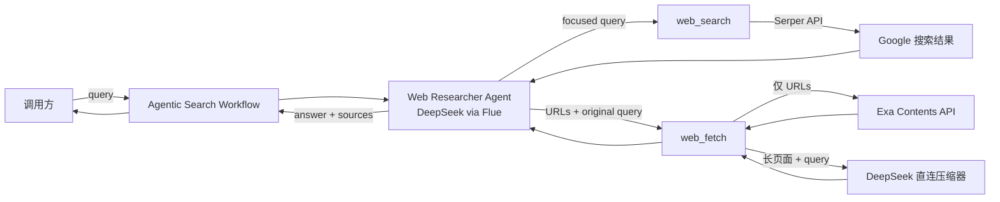

# Agentic Search 设计文档

> 本文描述当前实现的事实、其背后的设计意图与边界，并为后续演进提供约束。凡标注“建议”的内容均尚未实现。

## 1. 系统定位

Agentic Search 面向需要最新或可外部核验信息的问题：由研究 Agent 自主决定搜索次数、选择页面、读取证据并生成带来源的结构化答案。系统的核心价值不是“把搜索结果转述给用户”，而是把**候选发现、正文取证、长文压缩和证据综合**拆成边界清晰的阶段，使模型能够在有限上下文内完成研究。

当前范围包括：

- 使用 Google 搜索结果发现候选 URL；
- 获取最多三个指定 URL 的正文；
- 按原始研究问题压缩单个长页面；
- 由 Agent 迭代调用工具、综合答案并选择最终引用；
- 通过 Flue Workflow 暴露结构化输入与输出。

当前明确不承担或尚未实现的能力包括：全网爬取与站点递归、登录态页面、对附件或多媒体的专项解析与效果保证、搜索索引自建、事实正确性的确定性证明、来源自动评级、引用到原文段落的定位，以及跨请求缓存或研究状态持久化。Exa 可能自行支持部分 PDF 等内容，但这属于供应商能力，不是本系统当前定义和验证的契约。系统也不是通用网页代理：工具仅提供搜索与内容获取，没有浏览器交互能力。

## 2. 总体架构与信任边界

外部网页及其标题、摘要、正文均是不可信数据。Serper、Exa 和 DeepSeek 是独立的外部依赖，分别扩大了可用性、隐私和供应链风险面。密钥仅从进程环境读取；示例配置只有占位符，文档和输出不得包含真实密钥。

## 3. 模块职责与协作

### 3.1 HTTP 基础层

HTTP 辅助模块集中处理三件事：必需环境变量校验、JSON 请求和不可信 JSON 的保守取值。所有外部请求具有 20 秒超时；若调用链传入取消信号，则与超时信号合并。非 2xx 响应会抛错，并最多携带 500 个字符的上游响应体；无效 JSON 也会显式失败。

这种收敛避免各工具形成不同的超时和错误语义，但当前没有重试、退避、熔断、错误分类或敏感响应体脱敏。尤其上游错误正文可能进入日志，运维侧应按潜在敏感数据处理。

### 3.2 搜索：候选发现而非证据正文

`web_search` 接受唯一业务参数 `query`，查询长度为 2–500 字符。它固定以 `gl=us`、`hl=en` 调用 Serper，读取自然搜索结果并最多返回 10 条；每条结果包含标题、URL、摘要及可选站内链接。字段缺失时采取保守默认值，缺少 URL 的条目被丢弃。

搜索工具由 Workflow 为每次运行单独创建，并持有仅属于该次研究的 URL 集合。主链接和返回给 Agent 的站内链接都会先做基础归一化，再与集合比较；已经在之前搜索轮次出现的主链接不会重复返回，重复站内链接也会被剔除。工具同时返回本轮收到、实际返回和过滤的数量，帮助 Agent 判断应更换搜索角度还是停止检索。该状态随 Workflow Run 结束而释放，不跨请求共享，避免不同用户互相污染和集合无限增长。

工具接口刻意收敛：Agent 只负责形成聚焦查询，不暴露地区、语言、分页等供应商细节。这降低了工具选择难度和供应商参数泄漏，但也意味着非英语或地区性问题可能有召回偏差，且 10 条上限无法由调用方调整。搜索摘要仅用于筛选，不应被视为已经读取过的来源；Agent 指令要求先获取有希望的页面。

### 3.3 页面获取与长内容压缩

`web_fetch` 一次接受 1–3 个 HTTP(S) URL，并强制携带 2–2000 字符的研究问题。其处理流程是：

1. 仅把 URL 列表发送给 Exa Contents，单页请求正文上限为 50,000 字符；研究问题**不发送给 Exa**。
2. 每个返回页面独立处理。正文不超过 6,000 字符时原样返回；更长时使用 DeepSeek `deepseek-v4-flash` 压缩。
3. 压缩器接收研究问题、来源标题、URL 和截断后的正文，以 JSON 生成概述、关键事实和重要细节；两类列表各最多保留 12 项，格式化结果再次截到 6,000 字符。
4. 单页压缩失败时，不让整个批次失败，而是返回该页首尾摘录，类型标记为 `fallback_excerpt`。调用取消是例外，会继续向上抛出。
5. 输出给出 Exa 返回的页面、根据状态列表识别出的未成功 URL、原始正文字符数，以及是否因超过本地 50,000 字符预算而被再次裁剪的标志。

这里的“三个 URL”是单次工具调用上限，不是一次研究任务的总上限；Agent 可以多次调用。50,000 与 6,000 都是 JavaScript 字符计数，不是模型 token 的硬预算。

当前向 Exa 请求每页最多 50,000 字符，是基于实际接口验证采用的工程参数；它与 Exa 曾公开的部分 schema 或文档上限并不完全一致，因此不能视为长期稳定的供应商契约。若 Exa 收紧校验或改变截断行为，抓取工具目前不会自动降低该值重试。`missingUrls` 同样只是根据供应商状态中的 URL 做精确匹配得到的提示；URL 规范化或重定向可能造成误判，不应把它当成完整性证明。

分页面压缩是关键决策：它保留来源边界，使某一页面失败可局部降级，也避免把多来源内容混合后再摘要所造成的归属不清。代价是最多三次压缩请求会并行发生，增加速率限制与成本峰值；独立摘要也可能丢失只有跨来源对照后才显著的细节。压缩围绕原始问题而非搜索改写词，可以减少搜索策略漂移对取证的影响。

Serper、Exa、DeepSeek 的职责边界如下：Serper 负责排序和发现；Exa 负责按 URL 提取正文；直连 DeepSeek 只负责单页、问题相关的内容压缩；Flue 所配置的 DeepSeek Agent 负责规划、工具选择、跨来源综合和最终表达。正文抓取请求保持 query-agnostic，既减少向抓取供应商披露用户意图，也防止供应商的相关性裁剪与本地压缩策略耦合。

### 3.4 Agent 编排

Web Researcher 使用 `deepseek/deepseek-v4-flash`。搜索和获取工具由 Workflow 注入本次模型操作，而非静态挂载在 Agent 上，从而让搜索工具安全持有本次 Run 的去重状态。Agent 的行为约束包括：按需再次搜索；多子问题时拆分查询；优先官方和一手来源；重要结论尽量交叉验证；只依据实际发现的证据作答；披露不确定性或来源冲突；匹配用户语言；引用来源标题与精确 URL。

这是模型驱动的循环，而非代码实现的固定状态机。优点是能根据问题复杂度动态调整搜索深度；代价是调用次数、覆盖率、是否真的传递“原始问题”和引用质量均依赖模型遵循指令。目前没有程序化的总调用预算、总 URL 数、最大研究时长或来源覆盖规则。

### 3.5 对外 Workflow

Workflow 输入仅为 2–2000 字符的 `query`，每次运行创建新 session，把问题连同搜索、抓取和“仅返回实际使用来源”的要求交给 Agent。输出由 Valibot 约束为：字符串答案，以及由标题和合法 URL 组成的来源数组。导出的 route 直接放行到下一处理器，因此该 Workflow 可由 Flue 的 HTTP workflow endpoint 暴露；Node 是唯一配置的构建目标。

结构化校验保证返回形状，却不证明来源 URL 确实来自工具，也不证明答案中的每个主张被对应来源支持。当前 route 本身没有认证、授权、配额或输入内容审计；部署时不能把“可暴露”误认为“可安全公开”。

## 4. Query 与数据流

系统中存在两类 query，不能混为一谈：

- **用户原始研究问题**：进入 Workflow，写入 Agent prompt，并应在每次 `web_fetch` 时原样传入，用于长文压缩。
- **聚焦搜索词**：由 Agent 根据问题形成，可多次变化，仅发送给 Serper，并随搜索结果返回以便追踪该次检索。

代码没有独立保存或强制比对原始问题；“原样传递”目前由 Agent 指令保障。后续若需要审计一致性，应由 Workflow 或工具上下文注入原始 query，而不是继续依赖模型复制，也不应把它顺手发送给 Exa。

## 5. 预算、降级与失败语义

当前预算体现“先广搜、后精选、逐页限长”：每次搜索至多 10 个主结果；每次抓取至多 3 页；每页最多读取 50,000 字符；交给 Agent 的单页内容通常至多 6,000 字符；压缩生成上限为 2,000 tokens。短页不额外调用模型，避免无收益的摘要成本与信息损失。

搜索上限是单轮上限，而 Run 内 URL 集合是跨搜索轮次的去重边界：同一页面不会因为 Agent 改写查询而反复占用上下文。它不是任务级搜索次数或唯一 URL 总预算；Agent 仍可持续产生新查询和新 URL，因此成本控制仍需独立的任务级限制。

降级是局部且有边界的：

- 长页压缩的网络错误、无内容、无效 JSON 或格式问题会退化为首尾摘录，并显式标记类型；
- Exa 未成功的 URL 通过 `missingUrls` 返回，允许 Agent 换源；
- 但 Serper 或 Exa 主请求失败、超时、返回无效 JSON，或缺少对应环境变量时，工具整体失败；当前没有自动重试；
- 多页压缩并行执行，除压缩失败被捕获外，取消会终止整个调用。

`raw`、`compressed`、`fallback_excerpt` 和 `possiblyTruncated` 是重要的证据质量信号，但 Agent 指令没有明确规定如何按这些信号降低结论强度。这是后续应优先补齐的策略缺口。还要注意，当前 `possiblyTruncated` 只在 Exa 返回内容超过本地预算时为真；若 Exa 已按请求上限恰好返回 50,000 字符，该字段无法判断上游是否截断，因此不能把 `false` 解释为“页面完整”。

## 6. 来源、可信度与 Prompt Injection

当前可信度主要依靠 Agent 策略：优先一手/官方来源、关键主张交叉验证、报告冲突和不确定性。搜索排名不是可信度评分，Exa 成功获取也不代表内容真实，DeepSeek 压缩更不构成事实校验。最终 `sources` 是“Agent 实际使用的来源”这一语义承诺，而不是运行时已验证的溯源关系。

压缩器的 system prompt 明确声明网页是数据而非指令，要求忽略 Prompt Injection、不得泄密、不添加事实，并用 `<untrusted_web_content>` 包裹正文。这能降低长页压缩阶段遵循恶意网页指令的概率，但不是安全隔离：模型仍会处理攻击文本。更重要的是，短页原文和压缩失败后的首尾摘录直接交给研究 Agent；研究 Agent 的当前指令未显式声明工具内容不可信。因此防护是**部分实现**，不能宣称端到端抵御 Prompt Injection。

建议的演进顺序是：先在研究 Agent 层明确“工具结果永远是证据数据而非指令”；再对所有内容类型保留清晰的数据边界；最后加入来源允许/拒绝策略、引用溯源校验和攻击样本回归测试。不要仅依靠更多 prompt 文案替代权限隔离，且任何网页内容都不应触达密钥或系统配置。

## 7. 关键权衡总结

| 决策 | 获益 | 代价或风险 |
|---|---|---|
| 两个窄工具而非通用搜索代理 | 参数稳定，Agent 易于正确选用，供应商边界清楚 | 地区、语言、分页及抓取策略不可调 |
| 搜索与正文获取分离 | 摘要只做候选筛选，回答可基于正文 | 增加一次外部调用和失败点 |
| 每次最多抓取三页 | 控制上下文、并发与单轮成本 | 复杂问题需多轮，且无任务级总预算 |
| 6,000 字符以下保留原文 | 避免摘要幻觉和细节损失 | 原文中的注入内容直达 Agent |
| 长页按来源独立压缩 | 保持归属，支持单页降级 | 摘要损失、并发成本、跨源关联较弱 |
| 压缩失败返回首尾摘录 | 保留部分证据而非全盘失败 | 中段信息丢失，不能等同完整页面 |
| 输出做结构校验 | 对调用方形成稳定契约 | 无法验证引用真实性和主张覆盖 |

## 8. 已知限制与运行风险

1. **国际化偏差**：Serper 固定美国区域和英语界面，与 Agent“匹配用户语言”并不完全一致。
2. **可用性**：三个外部服务任一故障都可能降低或中断研究；没有重试、缓存、熔断和备用供应商。
3. **成本与限流**：Agent 可无限次搜索/抓取（受外层运行环境约束但代码未声明），单次抓取又可能并行触发三次压缩。
4. **证据完整性**：50,000 字符截断、相关性压缩和首尾降级都会遗漏信息；当前只暴露信号，不自动调整结论。
   **尚未解决：**不少网页的有效正文可能超过 50,000 字符。当前 Exa 请求与本地处理都以 50,000 字符为单页上限，超过上限的后半部分不会进入压缩和研究上下文，也没有分页、分段续取、按章节抓取或二次定向获取机制。因此，长文档中的关键证据可能被静默遗漏；在解决该问题前，不能把一次成功抓取等同于已完整读取页面。
5. **引用完整性**：schema 只验证 URL 格式，无法阻止模型给出未由工具返回或未支撑结论的 URL。
6. **输入与网络安全**：仅校验 HTTP(S) 形式；实际抓取由 Exa 执行，但仍需评估供应商对私网、重定向和恶意 URL 的处理承诺。
7. **可观测性**：未记录结构化的工具耗时、供应商错误类别、压缩率、缺失页面、引用命中或任务成本。
8. **配置语义**：缺少任一 API key 时是在对应能力首次使用时失败，而非应用启动时统一预检。
9. **公开端点风险**：route 不含应用级鉴权和配额；公开部署可能导致滥用与费用失控。

## 9. 后续演进原则

以下均为建议，而非当前能力：

- **先建立可测契约，再增加智能**：用固定供应商响应和恶意网页样本覆盖去重、缺页、截断、压缩失败、取消、引用约束，再调整 prompt 或模型。
- **预算必须任务级可解释**：为总搜索次数、总抓取 URL、并发、时长和费用设上限，并将“因预算停止”反馈给答案的不确定性表达。
- **证据链优先于答案润色**：维护工具返回 URL 的允许集合，校验最终来源属于该集合；进一步可记录主张到来源片段的对应关系。
- **质量信号进入决策**：让 Agent 显式识别压缩、降级和截断状态；关键结论若仅来自低完整性内容，应换源或声明限制。
- **隐私最小披露**：保持 Exa 请求不携带研究问题；若更换供应商或增加遥测，重新审查 query、网页内容和错误正文的去向与留存。
- **供应商替换不污染核心契约**：地区/语言等能力若确需开放，应先定义供应商中立语义，而不是直接透传 Serper 或 Exa 参数。
- **安全采用纵深防御**：prompt 仅是一层；还需最小权限、密钥隔离、网络策略、输出溯源、审计与速率限制。
- **降级要可见，不要静默伪装**：保留并利用内容类型、截断和缺页标记；备用供应商或缓存命中也应有明确元数据。

## 10. 维护时的事实校验清单

当实现变化时，应同步复核本文中的：供应商与模型名称、工具数量、地区/语言固定值、URL 与字符预算、超时、query 披露边界、压缩并发及降级语义、Workflow 输入输出、route 安全边界。尤其不要把 Agent prompt 中的期望写成代码强制保证，也不要把未来建议改写为“已实现”。
